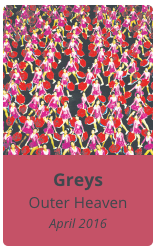
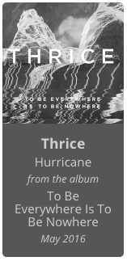
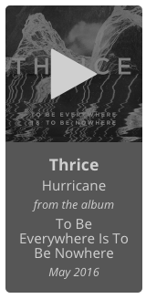
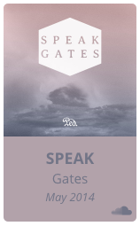
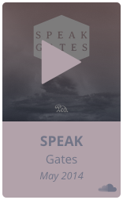
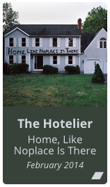
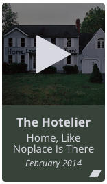

# Music Card

Place a Spotify, SoundCloud or Bandcamp link to an album or track in a markdown file and it will beautifully pull in the necessary data.

This uses [jwilsson's Spotify Web API PHP library](https://github.com/jwilsson/spotify-web-api-php
) to interface with the Spotify API,w and [Lokesh's Color Thief](https://github.com/lokesh/color-thief/) to retrieve colors from the album artwork.

The plan is to eventually support MusicBrainz links for albums that aren't on Spotify.

### Usage:

Spotify Album:

```markdown

```




Spotify Track:

```markdown

```





SoundCloud Track:

```markdown

```




Bandcamp Album:
```markdown

```




## Installation

1. [Create a Spotify Application](https://developer.spotify.com/my-applications).

2. [Create a SoundCloud Application](http://soundcloud.com/you/apps).

3. Copy this whole directory to your user/plugins directory.

4. In the plugins settings, fill in the Client ID, Client Secret, and Redirect URI from your Spotify Application.
    
### Thanks

Thanks to the Grav Team for writing the [MediaEmbed plugin](https://github.com/sommerregen/grav-plugin-mediaembed). I used this as a template to get things running at first.
